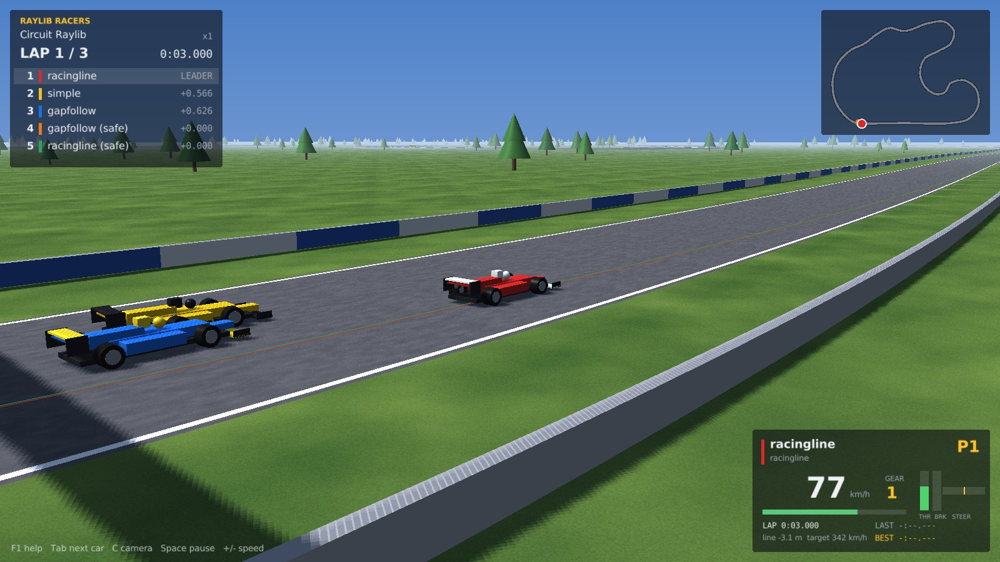
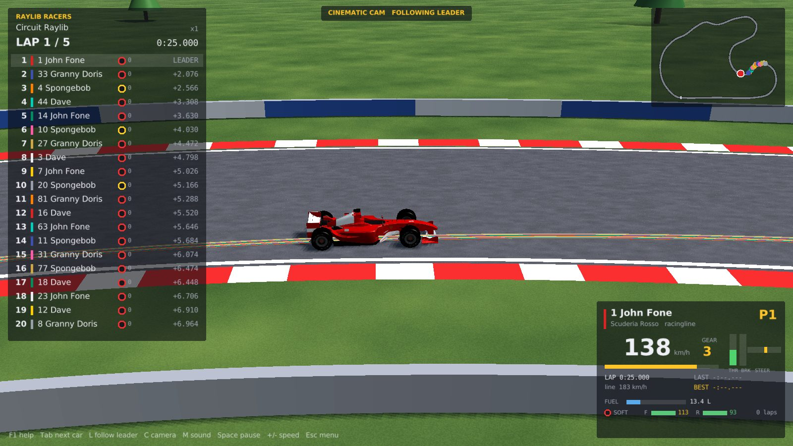
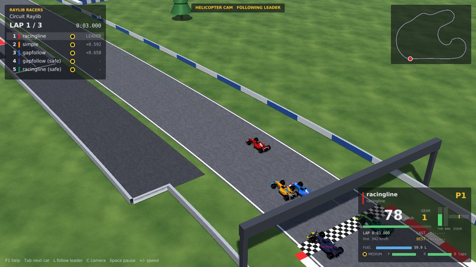
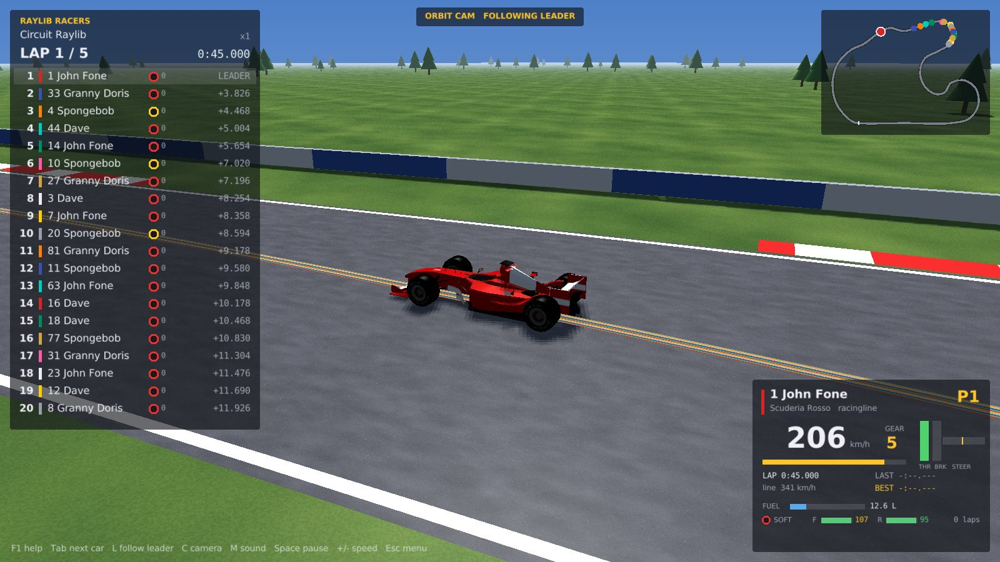
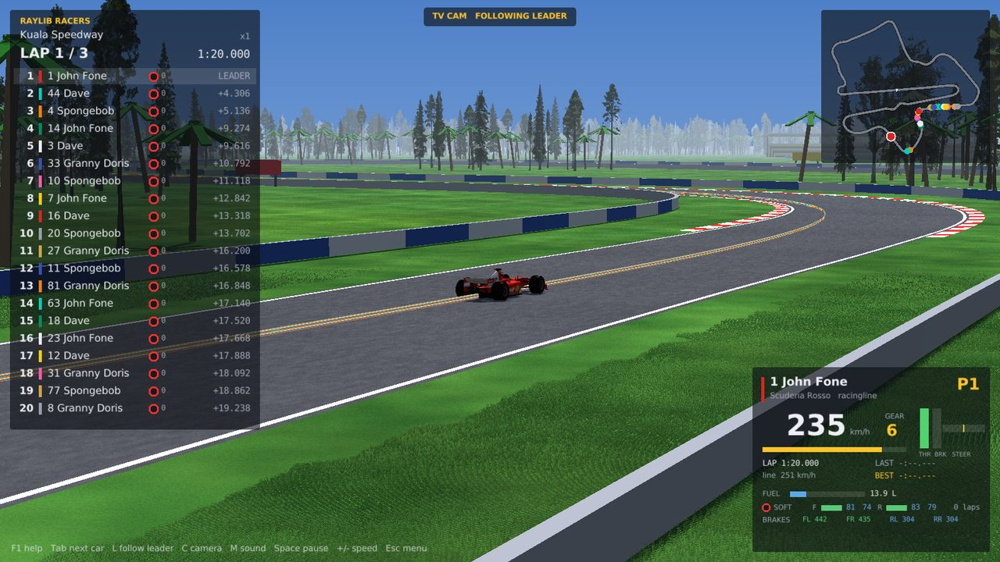
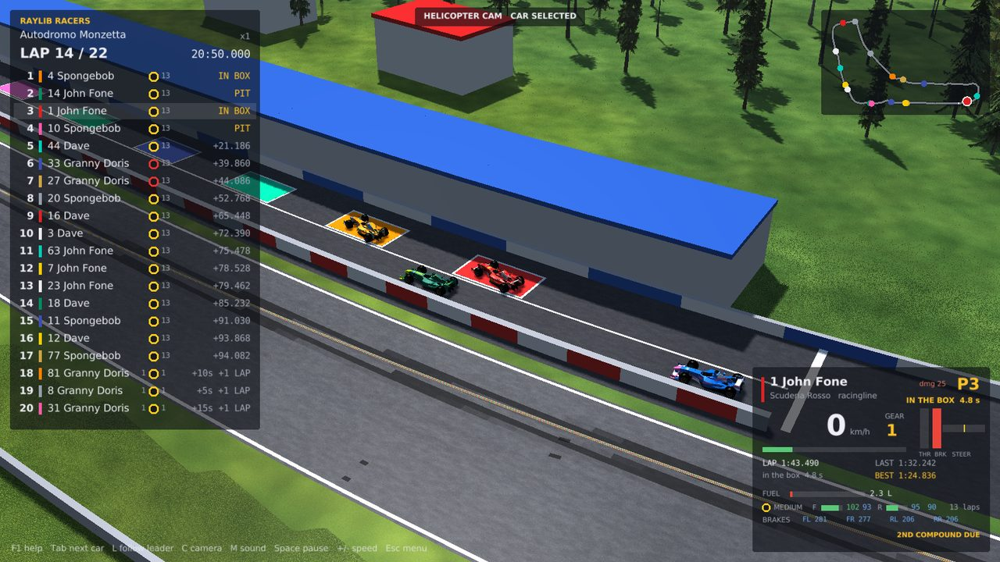
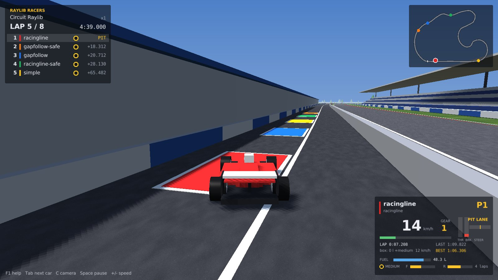

# Raylib Racers

A small, fast TORCS-style racing simulator for testing driving algorithms.
Cars are driven by **robots**: shared libraries written in C or C++ that read
sensors and return steering, throttle and brake. Races run headless at hundreds
of times real time for experiments, or in a raylib 3D viewer to watch them.



## What is in the box

- **Simulation core** (`src/core`, no graphics dependency): spline tracks, a
  planar dynamic-bicycle car model (load transfer, aero drag and downforce,
  tyre load sensitivity, friction circle, engine torque curve and gearbox),
  barrier and car-to-car collisions, lap timing and classification. Fixed 500 Hz
  physics, robots called at 50 Hz, fully deterministic.
- **Race mechanics**: fuel load and consumption, tyre wear with grip loss
  (soft, medium and hard compounds), damage that costs downforce, slipstream,
  and a pit lane with a speed limiter, a box per car and timed service (fuel,
  tyres, repairs).
- **Robot API** (`include/rr/robot_api.h`): one C header. Sensors follow the
  TORCS SCR championship (angle, track position, 19 range finders, 36 opponent
  sectors) plus the full track geometry and the car's pose, as TORCS robots get,
  the car's fuel, tyre and pit state, and the nearest cars for racecraft.
  Robots can take parameters from the command line, print status text, log
  debug values to telemetry and draw a path in the viewer.
- **Three example robots** (`bots/`): `simple` (C, sensors only), `gapfollow`
  (C++, sensors only) and `racingline` (C++, plans a minimum-curvature line and
  speed profile, runs a pit strategy, overtakes and defends).
- **`rr_race`**: headless runner with JSON results and per-car CSV telemetry.
  A 5-car, 3-lap race on the 3.2 km circuit takes about one second.
- **`rr_viewer`**: raylib 3D viewer with low-poly F1 cars in team liveries
  (steering, rolling wheels), sun shadows, fog, procedural textures, kerbs,
  barriers, pit lane and boxes, scenery, seven cameras, a timing
  tower (with tyres and pit status), minimap and a per-car panel with fuel and
  tyre wear.

| | |
|---|---|
|  |  |
|  |  |
|  |  |

## Build

Needs CMake 3.16+ and a C++17 compiler. The viewer needs raylib 5.5: if it is
not installed, CMake downloads and builds it.

```sh
cmake -S . -B build -DCMAKE_BUILD_TYPE=Release
cmake --build build -j
ctest --test-dir build          # quick smoke races
```

- **Linux**: raylib needs the X11/OpenGL headers, e.g. on Debian/Ubuntu
  `sudo apt install libx11-dev libxrandr-dev libxinerama-dev libxcursor-dev libxi-dev libgl1-mesa-dev`.
- **Headless only** (servers, CI, sweeps): `-DRR_BUILD_VIEWER=OFF` skips raylib entirely.
- macOS and Windows should work (the loader handles `.dylib`/`.dll`) but have
  not been tried yet.

## Run

```sh
./build/rr_viewer                                   # watch the example robots race
./build/rr_viewer --track oval --laps 5 --car racingline --car gapfollow
./build/rr_race --laps 3 --car racingline --car simple --json results.json
./build/rr_race --car racingline --params "grip=0.85,brake=0.7" --telemetry tel/
./build/rr_race --laps 25 --car racingline --car racingline --params "tires=1"   # full-length race with stops
./build/rr_viewer --laps 8 --wear-rate 6 --focus 0          # short race, tyres wear fast enough to force a stop
```

`--car` takes a robot name from `build/bots/` or a path to any robot library;
`--params` and `--name` apply to the car before them. `--help` lists all
options (noise on the range finders, physics step, robot rate, time limit,
`--fuel-rate` and `--wear-rate` multipliers).

The viewer opens on a **race setup** menu: track, race length, tyre life
(in laps of the chosen track; the menu measures a lap first), number of cars
(up to 20: ten teams of two, each with its own number), the session and a
**Grid** page where each car gets a livery and a driving algorithm (any robot
library in `bots/` shows up there). **Weekend** mode runs qualifying first:
each car goes out alone for an out lap and two flying laps, and the fastest
lap takes pole. `Enter` skips the current run, `Shift+Enter` the rest of
qualifying. `--no-menu` skips the menu.

The engine sound is synthesised from each car's revs and throttle (a V10 with
overrun pops and a rev limiter), for the cars nearest the camera. `M` mutes it;
`rr_viewer --sound-test out.wav --at 20` writes 25 s of it to a file.

Viewer keys: `Tab`/arrows change car, `1`-`9` focus by position, `L` goes back
to following the leader (the default), `C` / `Shift+C` cycle the cameras and
`F2`-`F8` pick one: follow, cinematic (eases between framings around the car),
TV, helicopter, top down, orbit, overview. The mouse wheel zooms the orbit,
helicopter and top-down cameras. `Space` pauses, `+`/`-` change speed
(up to 64x), `N` single-steps while paused, `R` restarts, `P` toggles robot
paths, `S` shows the focused car's range finders, `M` mutes, `Esc` returns to
the menu, `H` hides the HUD, `F1` help.

To grab a frame without a window manager (e.g. under `xvfb-run`):
`rr_viewer --screenshot shot.png --at 30 --camera 1`.

## Writing a robot

See [docs/ROBOTS.md](docs/ROBOTS.md). In short: export
`rr_robot_entry()` returning an `RRRobotApi` with `create`, `drive` and
`destroy`; build it as a shared library; pass it with `--car path/to/bot.so`.

## Tracks

Tracks are text files (`tracks/*.trk`): a name, a default width, the runoff to
the barrier, an optional pit lane and a list of control points in race order,
joined by a Catmull-Rom spline. A control point can carry its own width. The loader warns
when a corner is tighter than the track is wide or when the track overlaps
itself.

```
name My Track
width 14
runoff 7
pit left 20 80 420 500   # side, entry, lane start, lane end, exit (metres along the track)
pitspeed 22              # pit lane speed limit, m/s
p 0 0
p 300 0
p 400 120 16     # wider here
...
```

## Layout

```
include/rr/robot_api.h   robot ABI (C)
src/core/                track, car physics, race, robot loader, CLI
apps/headless/           rr_race
apps/viewer/             rr_viewer (renderer, HUD)
bots/                    example robots and shared helpers
tracks/                  circuit.trk, oval.trk
assets/fonts/            DejaVu fonts for the HUD (see DEJAVU_LICENSE.txt)
assets/cars/f1_gearari/  F1 car: body and wheel glTF, car.json, liveries (see its README)
```

## Current limits and next steps

- Flat tracks only (no elevation or banking), one car model.
- Racecraft is basic: overtaking between closely matched cars is rare and the
  first lap is often messy. `gapfollow` and `simple` never pit, so in long
  races they run out of fuel or tyres.
- Possible next steps: more tracks and a track editor, per-team car setups,
  batch tournaments and parameter sweeps with a summary report, a Python
  binding for learning-based drivers, replay files, and a TORCS track importer.
